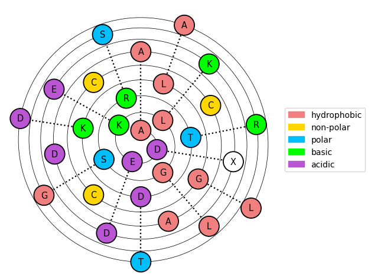

# 🛞 HelixPy

Plot wheel diagram for helical peptides.

## Usage

```python
import helixpy as hp

hp.pl.wenxiang(
    "ADEKLGSRTDKLGCCCADAXDEKLGSRTDAL",
    color="hbpa",
    add_amino_acid_label=True,
    add_legend=True,
    implosion_factor=0.015,
)
```

**Output:**

<div align="left">
  
</div>

## Installation

You need to have Python 3.10 or newer installed on your system.

```bash
pip install git+https://github.com/RasmusML/helixpy.git
```
